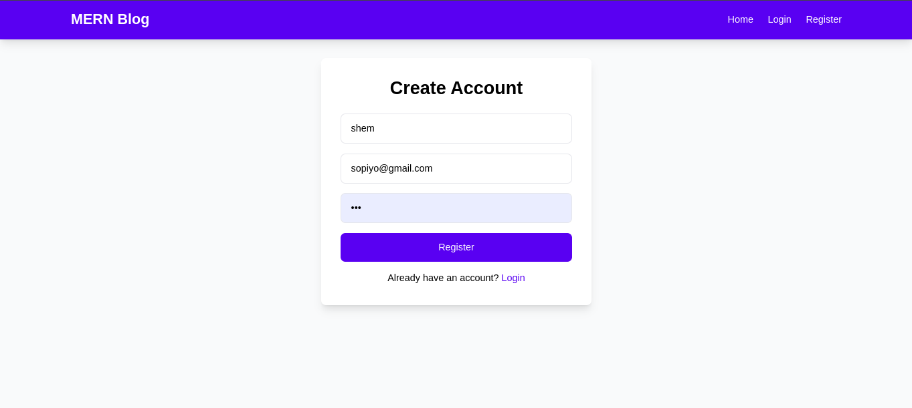
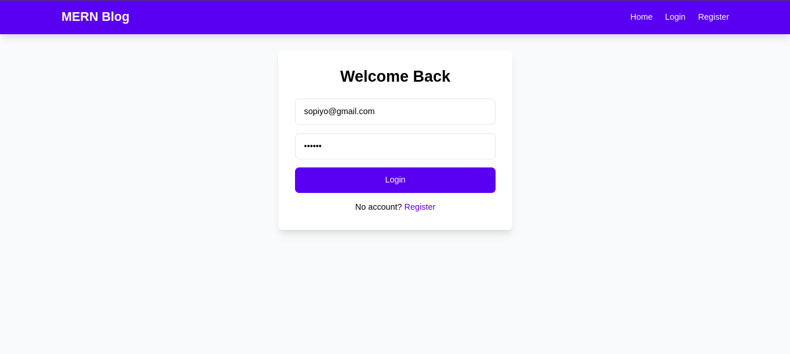
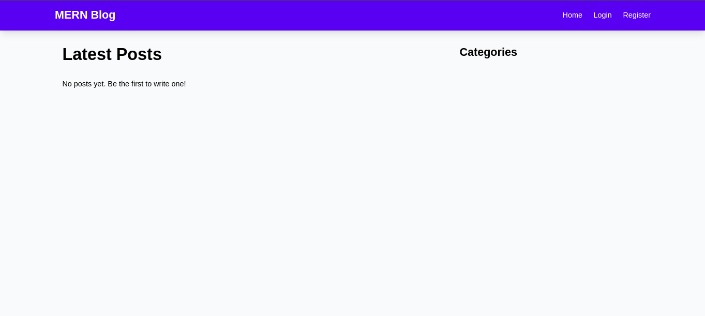
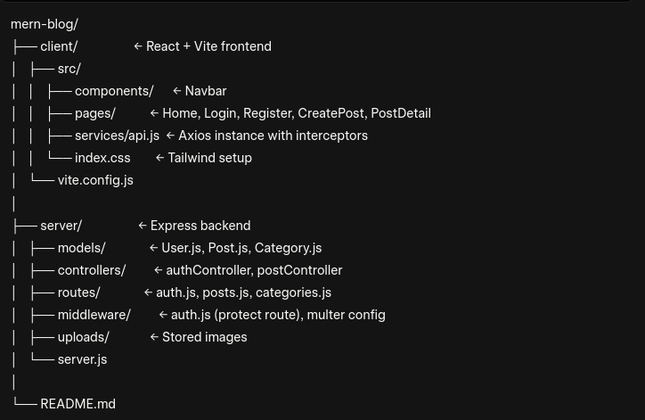

# MERN Blog – Full-Stack Blog Application

A modern, fully functional blog built with the **MERN stack** (MongoDB, Express, React, Node.js) featuring user authentication, image uploads, comments, categories, and a beautiful responsive UI powered by **Tailwind CSS**.
## Screenshots of the Application
## Register Page

## Login Page

## Home Page

## Features Implemented

- User Registration & Login (JWT Authentication)
- Protected Routes (only logged-in users can write posts)
- Create, Read, Update, Delete (CRUD) blog posts
- Featured image upload with Multer
- Add comments to posts
- Category system (posts belong to categories)
- Responsive, modern UI with Tailwind CSS
- Local MongoDB integration with Mongoose
- Clean separation: `server/` (backend) + `client/` (React frontend)

## Tech Stack

| Layer         | Technology                  |
|-------------|-----------------------------|
| Frontend     | React 18 + Vite + Tailwind CSS + React Router |
| Backend      | Node.js + Express           |
| Database     | MongoDB (Local) + Mongoose  |
| Auth         | JWT + bcryptjs              |
| File Upload  | Multer                      |
| API          | RESTful endpoints           |

## Project Structure 



## How to Run the Project

### 1. Start MongoDB (Local)
```bash
sudo systemctl start mongod
sudo systemctl enable mongod
```
### 2. Backend Setup
```
cd server
npm install
npm run dev
```
Server runs on: http://localhost:5000

### 3. Frontend Setup
```
cd client
npm install
npm install axios
npm run dev
```
Open: http://localhost:5173
### 4. First-Time Setup (One Time Only)
After logging in for the first time:
  1.  Open browser console
  2.  Run this to create a category

  ```
  fetch('http://localhost:5000/api/categories', {
  method: 'POST',
  headers: {
    'Content-Type': 'application/json',
    'Authorization': 'Bearer ' + localStorage.getItem('token')
  },
  body: JSON.stringify({ name: 'General' })
})
  ```
  Now you can create posts!

## API Endpoints (Selected)
### API Endpoints

| Method | Endpoint                  | Description                   |
|--------|---------------------------|-------------------------------|
| POST   | `/api/auth/register`      | Register a new user           |
| POST   | `/api/auth/login`         | Login user (returns JWT)      |
| GET    | `/api/posts`              | Get all posts                 |
| POST   | `/api/posts`              | Create post (protected)       |
| POST   | `/api/posts/:id/comments` | Add comment to a post         |
| GET    | `/api/categories`         | Get all categories            |


